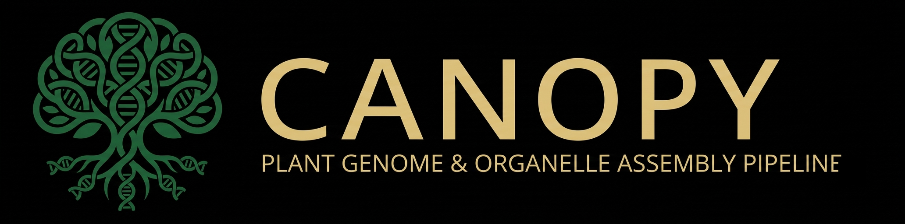
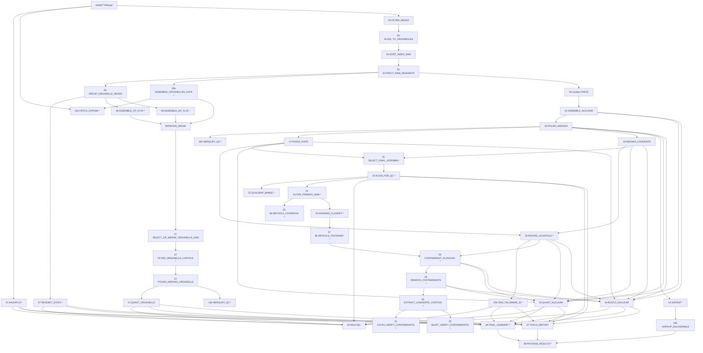

# Canopy

<!-- badges: start -->
[](https://github.com/Gian77/Canopy)
[](https://github.com/Gian77/Canopy/releases)
[](https://github.com/Gian77/Canopy/releases)
[](https://github.com/Gian77/Canopy/issues)
<!-- badges: end -->

<p align="center">
  
</p>

`Canopy` is a [nextflow](https://www.nextflow.io/) pipeline for plant genome assembly.
This pipeline is currently under development. At the moment this is ONT-only de novo
assembly developed for sorghum genomes with explicit organelle separation. The name
**Canopy** refers to the upper layer of a plant — the whole crown that emerges once every
branch and leaf is assembled together, much like how this pipeline assembles a complete
genome from thousands of individual long reads.

## Contact

Gian M. N. Benucci, Ph.D. — [benucci@msu.edu](mailto:benucci@msu.edu) — Michigan State University

## What Canopy does (for now)

For each sample:

1. **QC** — NanoPlot read-level QC
2. **Filter** — filtlong (min length 1 kb, min mean quality 80)
3. **Map to organelles** — minimap2 against combined cp + mt reference
4. **Partition reads** — split into chloroplast / mitochondrial / nuclear sets
5. **Assemble organelles** — Flye per compartment (default), or Oatk HMM-based read
   detection on all filtered reads (`--organelle_assembler oatk`)
6. **Filter organelle contigs** — reference-based filter removes nuclear-inserted
   organelle sequence (NUPTs/NUMTs)
7. **Polish organelles** — Medaka polishes the filtered chloroplast/mitochondria assemblies
   (previously only the nuclear assembly was polished, so organelle QC reflected raw ONT
   basecalling error rather than assembly quality)
8. **Assemble nuclear genome** — Flye
9. **Polish nuclear** — Medaka
10. **Purge duplicates** — purge_dups always runs; both the purged and unpurged
    (Medaka) genomes are carried forward for comparison
11. **Phase (optional)** — HapDup for diploid output (`--run_hapdup`, off by default)
12. **Scaffold (optional)** — RagTag correct + scaffold against `--nuclear_ref`, run on
    both candidate genomes
13. **Compare & select final** — QUAST + BUSCO score both candidates side-by-side (this
    exposes purge_dups over-purging); `--final_assembly medaka|purge` (default `medaka`)
    picks which one is published as the final genome
14. **Contaminant screening (optional)** — Kraken2 classification + BlobTools
    coverage/taxonomy blob plots on the final genome (`--run_kraken2`, `--run_blobtools`,
    `--run_qualimap`)
15. **Contaminant flagging (optional)** — `--flag_contaminants` flags a contig as
    contaminant only when **all three** hold: non-target phylum by BlobTools, unplaced by
    RagTag, and abnormal GC% — then produces a `decontam` genome version, QC'd with
    QUAST/BUSCO alongside the other candidates. Requires `--run_kraken2` + `--nuclear_ref`.
16. **Sylph corroboration (optional)** — `--verify_sylph` independently checks only the
    contigs flagged above against GTDB using containment ANI. It is advisory and does not
    change which contigs are removed; it requires `--flag_contaminants` and records a
    per-contig corroboration table in the published QC output and results archive.
17. **Reports** — MultiQC aggregation, a human-readable per-sample assembly summary
    (`FINAL_SUMMARY`, requires `--nuclear_ref`), a tool-citations report, and
    `PACKAGE_RESULTS` — zips the summary, final genome, organelle FASTAs, QUAST/BUSCO
    reports, and (when enabled) the blob plot, contamination audit, and Sylph corroboration
    into one small archive

## Workflow DAG

The workflow below shows the process structure. Stages marked `*` are optional or mode-dependent.



For the full process-level DAG from a run, use `nextflow run main.nf -preview` or open the
`dag.html` generated in the run's output directory.

## Directory structure expected

```
Canopy/
├── main.nf
├── nextflow.config
├── modules/
│   ├── qc.nf              # NanoPlot, filtering, QUAST, BUSCO, Qualimap, MultiQC
│   ├── mapping.nf          # organelle alignment, read partitioning
│   ├── dbs.nf              # OatkDB / Kraken2 PlusPFP fetch
│   ├── assembly.nf         # Flye / Oatk organelle + nuclear assembly
│   ├── polishing.nf        # Medaka (nuclear + organelle), purge_dups, HapDup
│   ├── scaffolding.nf      # RagTag correct + scaffold
│   ├── contamination.nf    # Kraken2 + BlobTools screening, contaminant flagging/removal
│   └── reports.nf          # FINAL_SUMMARY, TOOLS_REPORT, PACKAGE_RESULTS
├── helper-functions/
│   └── quay_tools.sh       # quay.io biocontainer image lookup/verification helpers
├── refs/                        <-- you provide
│   └── sorghum/*.fasta
└── reads/                       <-- you provide
    ├── sample_A/
    │   └── *.fastq.gz
    ├── sample_B/
    │   └── *.fastq.gz
    └── ...
```

## Running

### Local test (validate the wiring, no compute)

To check the pipeline wires up correctly (channels, params, DAG) without running any process
or needing real coverage, use `-preview` (see Sanity checks below). For an actual assembly run
use the full reads from one real biological sample.

```bash
nextflow run main.nf \
    --reads /path/to/reads \
    --cp_ref /path/to/sorghum_chloroplast.fasta \
    --mt_ref /path/to/sorghum_mitochondrion.fasta \
    --outdir results_local
```

### HTCondor (production)

`-profile condor` submits pipeline processes to HTCondor. Run the Nextflow head processes from
the submit node (`scarcity-ap-1`). The launchers start all five samples concurrently, with
separate output, work, and log directories for each sample.

The five samples currently in `reads/` are:

```text
B11077  BTx2932  F07020  F10702  F25101
```

#### Run all samples

Recommended: submit the head process to Condor.

```bash
condor_submit pipeline.condor
condor_q
```

This submits five independent jobs using `run_pipeline_condor.sh`. To run the five head
processes directly in the background instead:

```bash
bash run_pipeline.sh
```

Both commands run all samples concurrently and create `results_<sample>/`,
`nf-work-<sample>/`, and sample-specific logs under `condor_logs/`. Set
`FINAL_ASSEMBLY=purge` before either command to publish the
purged nuclear assembly instead of the default Medaka assembly:

```bash
FINAL_ASSEMBLY=purge condor_submit pipeline.condor
```

The launchers enable the complete workflow except HapDup phasing: Qualimap, BlobTools,
Kraken2, contaminant flagging/removal, Sylph corroboration, and BLAST corroboration. HapDup
remains disabled because neither launcher includes `--run_hapdup true`.

#### Run one hardcoded sample

Edit the `SAMPLES` line near the top of both launchers. For example, to run only F10702:

```bash
SAMPLES=(F10702)
```

Then launch it using either method:

```bash
condor_submit pipeline.condor
# or
bash run_pipeline.sh
```

To choose another sample, replace `F10702` with the directory name under `reads/`. The sample
name must match a directory containing one or more `*.fastq.gz` files.

To watch the Nextflow log:

```bash
./watch_pipeline.sh
```

Stop a Condor head job with `condor_rm <cluster_id>`. Use `-resume` in the launchers to continue
completed work after an interruption; remove old `results_<sample>/` and `nf-work-<sample>/`
directories first when a genuinely fresh run is required.

For a one-off run against different data, the plain inline command works too:

```bash
nextflow run main.nf \
    -profile condor \
    --reads /path/to/reads \
    --cp_ref /path/to/sorghum_chloroplast.fasta \
    --mt_ref /path/to/sorghum_mitochondrion.fasta \
    --outdir results \
    -w /scratch/$USER/nf-work-canopy \
    -resume
```

### Enable HapDup phasing

Add `--run_hapdup` to either command above.

## Sequencing chemistry (input data)

All reads processed by this pipeline so far are ONT **V14 chemistry**, sequenced on a
**FLO-PRO114M (R10.4.1)** flow cell. Basecalling was **simplex only** — MinKNOW's
on-instrument software does not offer live duplex basecalling — using the
**Super-accurate basecalling (SUP), 400bps** model. This is why `--medaka_model` defaults
to an `r1041_e82_400bps_sup_*` model (see [Key parameters](#key-parameters) below); if you
sequence with different chemistry, a different flow cell, or a different basecaller
speed/accuracy setting, pick the matching Medaka model instead.

## Key parameters

| Parameter               | Default                                | Notes                                                          |
|------------------------|-----------------------------------------|-----------------------------------------------------------------|
| `--reads`               | `./reads`                              | Dir containing `<sample_id>/*.fastq.gz`                        |
| `--cp_ref`              | (required)                             | Chloroplast reference FASTA                                    |
| `--mt_ref`              | (required)                             | Mitochondrion reference FASTA                                  |
| `--nuclear_ref`         | none                                    | Nuclear reference FASTA; enables RagTag scaffolding, QUAST genome-fraction, and `FINAL_SUMMARY` |
| `--organelle_assembler` | `flye`                                 | `flye` (per-compartment) or `oatk` (HMM-based read detection)  |
| `--genome_size`         | `720m`                                 | Estimated nuclear genome size for Flye                         |
| `--medaka_model`        | `r1041_e82_400bps_sup_v5.0.0`          | Match your basecaller + chemistry                               |
| `--busco_lineage`       | `poales_odb10`                         | Plant lineage; downloaded auto by BUSCO                        |
| `--run_hapdup`          | `false`                                | Enable for diploid phasing                                     |
| `--calcuts_args`        | `""` (autotune)                        | Manual purge_dups cutoffs, e.g. `"-l 5 -m 22 -u 120"`           |
| `--final_assembly`      | `medaka`                               | `medaka` (unpurged) or `purge` — selects the published final nuclear genome; purge_dups always runs and both are compared |
| `--run_qualimap`        | `false`                                | BAM-level coverage QC on the final genome                      |
| `--run_blobtools`       | `false`                                | Coverage-vs-GC blob plot on the final genome (no taxonomy)      |
| `--run_kraken2`         | `false`                                | Taxonomic contaminant screening on the final genome (needs `--kraken2_db` / `--taxdump_dir`) |
| `--kraken2_db`          | PlusPFP DB path                        | Kraken2 database (Standard + protozoa/fungi/plant); ~231.5 GB loaded, needs a big-RAM node |
| `--taxdump_dir`         | PlusPFP DB path                        | NCBI taxdump (nodes.dmp/names.dmp) BlobTools uses to resolve Kraken2 taxids |
| `--kraken2_confidence`  | `0.1`                                  | Kraken2 `--confidence`; without it, long contigs can get spuriously classified from a handful of stray k-mer hits |
| `--flag_contaminants`   | `false`                                | Flags + removes contaminant contigs (needs `--run_kraken2` + `--nuclear_ref`); produces a `decontam` genome version |
| `--contam_target_phylum`| `Streptophyta`                         | Plant phylum for the non-target-phylum check                   |
| `--contam_gc_min`/`--contam_gc_max` | `0.20` / `0.70`             | Eukaryotic-normal GC fraction range for the flagging rule       |
| `--verify_sylph`        | `false`                                | Advisory ANI corroboration of flagged contigs against GTDB; requires `--flag_contaminants` |
| `--sylph_db`            | `${projectDir}/databases/sylph/gtdb-r226-c200-dbv1.syldb` | Sylph GTDB sketch database; downloaded automatically if the path is absent |
| `--sylph_min_ani`       | `90`                                  | Minimum adjusted ANI passed to Sylph query                             |
| `--verify_blast`        | `false`                               | Advisory BLASTn corroboration; uses remote NCBI BLAST unless `--blast_db` is supplied |
| `--blast_db`            | `null`                                | Optional directory containing a local NCBI BLAST nucleotide database with prefix `nt` |
| `--blast_remote`        | `true`                                | Use NCBI remote BLAST when no local database is supplied                       |
| `--blast_min_identity`  | `90`                                  | Minimum BLASTn percent identity for corroboration                     |
| `--blast_min_qcov`      | `50`                                  | Minimum BLASTn query coverage percentage for corroboration             |
| `--outdir`              | `results`                              | Output directory                                                |

> `--skip_purge` is retired — purge_dups always runs now; use `--final_assembly medaka` (equivalent to the old skip behavior) or `--final_assembly purge`.

To enable independent Sylph corroboration alongside contaminant flagging:

```bash
--run_kraken2 true \
--flag_contaminants true \
--verify_sylph true
```

Sylph queries only the small set of candidate contigs, while its GTDB sketch database is
stored under `databases/sylph/` and reused across runs. A Sylph non-match is not treated as
proof that Kraken2/BlobTools was wrong; short contigs may simply lack enough sequence for a
confident ANI estimate.

To add BLASTn corroboration using NCBI's remote service, enable:

```bash
--run_kraken2 true \
--flag_contaminants true \
--verify_sylph true \
--verify_blast true
```

BLASTn is run only on contigs already flagged by the conservative contamination rule. Its
results are advisory and are written alongside the Sylph results; neither method changes the
removal decision. For a reproducible offline run, supply `--blast_db` pointing to a local
formatted NCBI database with prefix `nt`; remote results reflect the current NCBI database.

## Resource classes (configured in nextflow.config)

| Label             | CPUs | RAM     | Time   | Used by                                         |
|-------------------|------|---------|--------|--------------------------------------------------|
| `qc`              | 16   | 128 GB  | 12h    | NanoPlot, filtlong, MultiQC, BlobTools, contaminant flagging |
| `qc_heavy`        | 16   | 128 GB  | 24h    | BUSCO, QUAST, Qualimap                          |
| `map`             | 24   | 128 GB  | 12h    | minimap2 + samtools                              |
| `assemble_small`  | 16   | 128 GB  | 6h     | Flye on cp / mt, RagTag                          |
| `assemble_heavy`  | 32   | 448 GB  | 120h   | Flye nuclear, HapDup, Kraken2 classification     |
| `polish`          | 24   | 256 GB  | 48h    | Medaka, purge_dups                               |

`KRAKEN2_CLASSIFY` runs under `assemble_heavy` (448 GB, restricted to specific big-RAM nodes)
so the ~231.5 GB loaded PlusPFP index fits fully in RAM instead of relying on
`--memory-mapping`.

Adjust to your cluster's queue limits and node capacity.

## HPC notes (GLBRC / HTCondor)

- **Run Nextflow from the submit node** — it dispatches jobs, doesn't compute. Use `tmux` or `screen` to keep it alive.
- **`work/` directory MUST be on scratch** — assembly intermediates are 100s of GB. Use `-w /scratch/$USER/nf-work-canopy`.
- **Apptainer install required** — install via `conda install -c conda-forge apptainer -y` in the Nextflow env.
- **First run downloads several container images** — takes 10–20 min, cached in `~/.apptainer_cache`.

## Sanity checks before running

```bash
# Verify config parses
nextflow config -profile condor

# Show the DAG without running anything
nextflow run main.nf -preview --cp_ref ... --mt_ref ...

```

Use the launcher instructions above for a real run. They ensure that each sample gets its own
output and work directory.

## For containers

### 1) search the hash and then use the link to find the quay image

For example for both samtools and minimap

```
curl -sO https://raw.githubusercontent.com/BioContainers/multi-package-containers/master/combinations/hash.tsv
grep -E "^minimap2=.*samtools=|^samtools=.*minimap2=" hash.tsv
```

Then paste the packages in:
https://midnighter.github.io/mulled

### 2) Use the quay_tools.sh

For single-tool images, for example for `flye` just check `quay.io` directly at:
https://quay.io/repository/biocontainers/flye?tab=tags

Or you can find the tag directly, with an API call

```
conda activate base
curl -s 'https://quay.io/api/v1/repository/biocontainers/flye/tag/?limit=20&onlyActiveTags=true'  | \
python -m json.tool | grep '"name"' | head -10

# Then pick the most recent one matching the version you want, then build the image reference:
quay.io/biocontainers/flye:<paste-tag-here>

# That turns into:
container 'quay.io/biocontainers/flye:2.9.4--py310h2b6aa90_0'
```

#### Alternative option

`helper-functions/quay_tools.sh` ships in this repo so it's available to anyone who clones
Canopy. Source it to search through quay.io, verify an image exists and is pullable, and test
a command for the tool you're looking into using. This works for images that have a single
tool. If you need/want more than one tool in an image, use the mulled images instead — see
above.

To use the script, you need a conda nextflow environment with `apptainer` installed.

For example, from the repo root:
```
[benucci@scarcity-ap-1 Canopy]$ source helper-functions/quay_tools.sh
[benucci@scarcity-ap-1 Canopy]$ conda activate nextflow
(nextflow) [benucci@scarcity-ap-1 Canopy]$ quay_tags flye
quay.io/biocontainers/flye:2.9.6--py313h7fbb527_1
quay.io/biocontainers/flye:2.9.6--py312h734f728_1
quay.io/biocontainers/flye:2.9.6--py311h93bbee8_1
quay.io/biocontainers/flye:2.9.6--py310h5850263_1
quay.io/biocontainers/flye:2.9.6--py310h275bdba_0
quay.io/biocontainers/flye:2.9.6--py39h475c85d_0
quay.io/biocontainers/flye:2.9.6--py311h2de2dd3_0
quay.io/biocontainers/flye:2.9.5--py310h275bdba_2
quay.io/biocontainers/flye:2.9.5--py39h475c85d_2
quay.io/biocontainers/flye:2.9.5--py312h5e9d817_2
...

(nextflow) [benucci@scarcity-ap-1 Canopy]$ verify_image quay.io/biocontainers/flye:2.9.4--py310h2b6aa90_0
[OK pull] quay.io/biocontainers/flye:2.9.4--py310h2b6aa90_0  (no command check)
(nextflow) [benucci@scarcity-ap-1 Canopy]$ verify_image quay.io/biocontainers/flye:2.9.4--py310h2b6aa90_0 "flye --version"
[OK] quay.io/biocontainers/flye:2.9.4--py310h2b6aa90_0  (flye --version works)
(nextflow) [benucci@scarcity-ap-1 Canopy]$
```

> **Known broken image:** `quay.io/biocontainers/flye:2.9.6--py313h7fbb527_1` dies with SIGILL
> (illegal CPU instruction) on the Condor compute nodes. Use `2.9.4--py310h2b6aa90_0` instead —
> see `CLAUDE.md` for the full container-verification policy.

# Start interactive sessions in scarcity

## Method 1: tmux (recommended)

```
# Start a new session named "canopy"
tmux new -s canopy

# Inside tmux, launch all five samples
cd /mnt/cephfs/linuxhome/benucci/Canopy
bash run_pipeline.sh
```

<div style="padding: 15px; border: 1px solid #007bcc; background-color: #f0f8ff; border-radius: 5px;"> 
    <strong>More about tmux use:</strong> To Detach from tmux (leaves it running), press <code>Ctrl-B</code>, then <code>D</code>. Now you can close your laptop, log out, whatever. If you want to copy output on the terminal you can press <code>Ctrl + b</code> then release. Press the <code>[</code> key (this enters "copy mode"). Use your <code>Up/Down</code> arrow keys or <code>Page Up/Page Down</code> to scroll through your output. Press <code>q</code> to exit scroll mode and return to typing. 
</div>

To reconnect later from anywhere:
```
ssh scarcity-ap-1.glbrc.org
tmux attach -t canopy
```

## Method 2: nohup
Simpler but less interactive — no live progress bars to look at:

```
bash run_pipeline.sh

# Check progress later:
tail -f condor_logs/pipeline.stdout.txt
cat condor_logs/pipeline.pid
```

# To clean up and start a complete new session

```
cd /mnt/cephfs/linuxhome/benucci/Canopy

# Remove per-sample work directories (cached task outputs — these are the big ones)
rm -rf nf-work-*

# The .nextflow hidden directory (history, cache metadata, session info)
rm -rf .nextflow/

# The published results from previous runs (back them up first if needed)
rm -rf results results_*/

# Any leftover log files
rm -f .nextflow.log* nextflow_report*.html timeline*.html trace*.txt
```

And to cancel a `tmux` session, after closing it

```
tmux kill-session -t canopy
tmux ls    # should now say "no server running"
```


# Additional cleanups

## Check and clean the apptainer cache
```
apptainer cache list -v
apptainer cache clean
```
